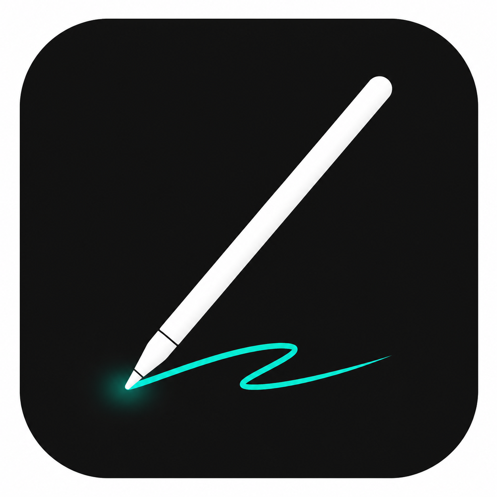

<p align="center">
  
</p>

<h1 align="center">FloatPen · 悬浮画笔</h1>

<p align="center">
  <strong>A floating annotation pen for Android phones and tablets</strong>
</p>

<p align="center">
  <em>Draw as you explain.</em>
</p>

<p align="center">
  Tap the floating button to open a transparent canvas over slides, PDFs, web pages, or video calls.<br />
  Highlight ideas with your finger or stylus, then exit with one tap to return to your app.
</p>

<p align="center">
  <a href="https://github.com/Pxuzy/float-ink/releases/latest"></a>
  <a href="https://github.com/Pxuzy/float-ink/stargazers"></a>
  <a href="LICENSE"></a>
  <br />
  <a href="#version-and-download"></a>
  <a href="README.md" lang="zh-CN"></a>
</p>

<p align="center">
  <a href="https://github.com/Pxuzy/float-ink/releases/latest"><strong>Download APK</strong></a> ·
  <a href="#quick-start">Quick start</a> ·
  <a href="#features">Features</a> ·
  <a href="docs/releases/v0.3.25.md">Release notes (Chinese)</a> ·
  <a href="https://github.com/Pxuzy/float-ink/issues">Report an issue</a>
</p>

---

## Features

| | Feature | What it does |
|---|---|---|
| ✍️ | Transparent canvas | Annotate over your current app with a finger or stylus |
| 🫧 | Floating button | Drag it freely, with optional auto-hide near the screen edges |
| 📐 | Drawing tools | Highlight ideas with a pen, lines, arrows, rectangles, and circles |
| 🎨 | Tool styles | Save colors and widths per tool and switch colors from the floating toolbar |
| 🗂️ | Boards and layers | Switch boards, reorder or hide layers, and undo or clear the active layer |
| 📏 | Proportion guides | Use golden-ratio guides and two-point Fibonacci retracement for visual explanations |

## Version and download

- **Current version:** `0.3.25` (`versionCode 39`)
- **Supported devices:** Phones and tablets running Android 10 (API 29) or later
- **Official download:** [GitHub Releases](https://github.com/Pxuzy/float-ink/releases/latest)
- **Package name:** `com.pxuzy.floatingpen`

## Use cases

| Use case | How FloatPen helps |
|---|---|
| Teaching | Circle, connect, and highlight key points on slides, web pages, or PDFs |
| Remote collaboration | Explain shared content or video calls with immediate annotations, without editing screenshots |
| Live demonstrations | Enter and exit the canvas from the floating button with minimal interruption |
| Composition and proportions | Explain proportions using golden-ratio guides or two-point Fibonacci retracement |

## Installation

1. Open [FloatPen Releases](https://github.com/Pxuzy/float-ink/releases/latest) and download the latest APK.
2. Confirm installation in the Android system installer. When installing an APK from a browser or file manager for the first time, Android may ask you to allow that source to install unknown apps.
3. Open FloatPen and grant the “Display over other apps” permission when prompted.
4. Enable the floating button in the app.

> Official releases use the same signing certificate, so you can install updates over an existing official release while keeping app data. Android cannot install an official release over a Debug or test build signed with a different certificate. Before uninstalling the old build, check whether you need to preserve any data.

## Quick start

```text
Open FloatPen
  → Grant overlay permission and enable the floating button
  → Switch to the app you want to annotate
  → Tap the floating button to open the transparent canvas
  → Choose a tool, color, and width, then draw
  → Tap Exit to return to the underlying app
```

### Floating button

- Press and drag to place the button anywhere within the screen.
- When “Auto-hide at the edge when nearby” is enabled, releasing the button near the left or right edge snaps it to that edge and hides it after the configured delay. Turning this setting off disables automatic snapping and hiding.
- Adjust opacity, auto-hide, and the hide delay in settings.
- Tap the button to open the canvas. After it hides, use the wake interaction available on your device to reveal it again.

### Transparent canvas

- Supports finger and stylus input.
- Includes pen, line, arrow, rectangle, and circle tools.
- Each tool saves its own color and width. Setting changes are synchronized with the running canvas.
- Color selection in the floating toolbar applies to all tools by default. To apply it only to the current tool, change the color scope under Settings → Floating toolbar. The settings page also includes a live toolbar preview.
- Undo and Clear affect only the active layer.
- Tap Exit to close the drawing overlay and restore touch input to the underlying app. The current session is retained until the floating service is stopped.

### Boards and layers

- Create multiple boards in a session. Each board starts with one layer.
- Create, switch, rename, or delete boards and layers.
- Show, hide, and reorder layers. Visible layers are composited in their current order.
- Stopping the floating service clears the current temporary session.

### Guide tools

| Tool | How to use it |
|---|---|
| Golden-ratio guides | Show draggable horizontal and vertical guides that snap near `38.2%` or `61.8%`. |
| Fibonacci retracement | Place two endpoints to display levels at `0 / 23.6 / 38.2 / 50 / 61.8 / 78.6 / 100%`. Drag either endpoint to adjust the range, or drag the white midpoint to move the whole guide. |

Guide tools are independent of regular strokes. They are not included in layers, undo, clear, or session data.

## Updates

See the [v0.3.25 release notes (Chinese)](docs/releases/v0.3.25.md) for the full changelog.

The recommended update path is Settings → Software update → Check for updates.

You can also download an APK from [GitHub Releases](https://github.com/Pxuzy/float-ink/releases) and update through the Android system installer. Before opening the installer, the app checks the APK package name, version code, and official signature. You confirm installation in the Android system interface.

## Device settings

Some Android systems restrict background overlay services. If the floating button disappears frequently or the service stops, check that:

- Overlay permission is enabled.
- Battery usage is set to “Unrestricted” or the equivalent option on your device.
- Auto-start is allowed and the app is locked in the recent-apps screen, if your device provides these options.

Settings vary by manufacturer. See the [deployment and device setup guide (Chinese)](docs/DEPLOY.md) for details.

## Privacy and permissions

FloatPen is a lightweight tool for temporary annotations, not a screenshot editor or cloud whiteboard.

| Permission | Purpose |
|---|---|
| `SYSTEM_ALERT_WINDOW` | Show the floating button and transparent drawing overlay |
| `FOREGROUND_SERVICE` / `FOREGROUND_SERVICE_SPECIAL_USE` | Keep the floating service running, including on Android 14+ |
| `POST_NOTIFICATIONS` | Show the foreground service notification on Android 13+ |
| `INTERNET` | Check GitHub Releases and download APK updates |
| `REQUEST_INSTALL_PACKAGES` | Hand a verified APK to the system installer |

FloatPen does not:

- Take screenshots, record the screen, or read or save the underlying app's screen content.
- Upload strokes, create accounts, sync to the cloud, or collect analytics.
- Request gallery, camera, microphone, accessibility service, screen recording, or broad storage access.
- Install updates silently or bypass Android's signature and installation safeguards.

## Validation status

The project has JVM/Robolectric automated tests and Debug build verification. Manufacturers impose different restrictions on overlays, background services, notifications, and installers. Stylus feel, orientation changes, split-screen behavior, and manufacturer-specific background policies still need verification on target devices.

## For developers

The app uses native Android, Kotlin, and Gradle. See [Project state (Chinese)](docs/PROJECT_STATE.md) and [Project goals (Chinese)](docs/GOAL.md) for development, testing, release checks, and project status.

## License

Published by `Pxuzy` under the Apache License 2.0. You may use, modify, commercially use, and redistribute this project subject to the license's copyright, license, and attribution requirements.

See [LICENSE](LICENSE) for the full terms, and [Third-party notices (Chinese)](docs/THIRD_PARTY_NOTICES.md) for third-party icon resources and their licenses.
